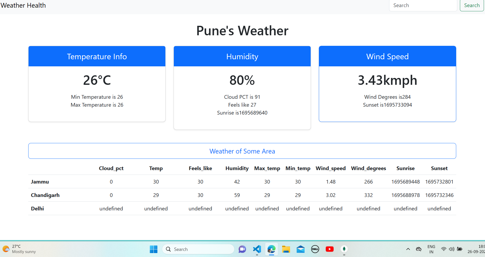

# Weather Health Web Application

## Description

Weather Health is a simple web application that provides weather information for different cities. It uses the RapidAPI service to fetch weather data and display it to the user. Users can search for weather information for a specific city, and the app also provides pre-defined weather data for cities like Jammu, Chandigarh, and Delhi.

## Features

- **Weather Information**: Get detailed weather information for a specific city, including temperature, humidity, cloud coverage, wind speed, and more.

- **Pre-defined Cities**: Easily access weather data for pre-defined cities like Jammu, Chandigarh, and Delhi.

- **Responsive Design**: The web application is responsive and works well on various devices, including desktops, tablets, and mobile phones.

## Usage

1. **Search for Weather**: Enter the name of a city in the search bar and click the "Search" button. The app will fetch and display weather data for the specified city.

2. **Pre-defined Cities**: You can also click on pre-defined city names (Jammu, Chandigarh, Delhi) to view weather information for these cities without manually entering the city name.

3. **Navigation**: Explore additional information about the app, such as an "About" section, by using the navigation menu at the top.

## Installation

There is no specific installation required for this web application. Simply open the `index.html` file in a web browser to use the app. Ensure you have an active internet connection to fetch weather data.

## Libraries and APIs Used

- [RapidAPI](https://rapidapi.com/) - Used to fetch weather data for cities.

- [Bootstrap](https://getbootstrap.com/) - Used for responsive web design and styling.

## Credits

This web application was created by Lovely Sehotra.

## Acknowledgments

- RapidAPI for providing weather data.

- Bootstrap for the responsive design framework.

